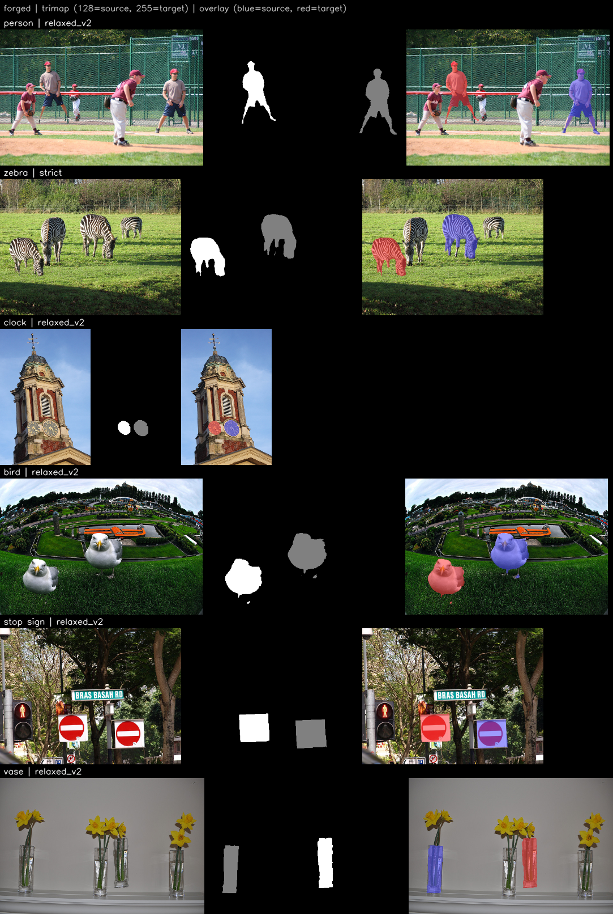

# COCO-CMFD

A synthetic copy-move forgery dataset generated from MS-COCO 2017, with
source/target-separated ground truth for training and evaluating
copy-move forgery detection (CMFD) models.

Each sample takes one annotated COCO object, applies a mild affine
transform, and pastes it elsewhere in the *same* image at a location
that passes a set of scene-plausibility checks (support surface,
horizon band, perspective scale, occlusion). Ground truth is emitted at
four granularities: a 3-class trimap, a binary mask, a 16 px patch-label
grid, and a hard-negative mask of the scene's other objects.

- **Dataset (Hugging Face):** `TODO — add link after upload`
- **DOI (Zenodo):** `TODO — add badge after first GitHub Release`



*Left to right: forged image, trimap (128 = source, 255 = target),
overlay (blue = source, red = pasted copy).*

## Contents

| | |
|---|---|
| Samples | 12,271 |
| Source images | 7,150 distinct COCO train2017 images (1–8 samples each, mean 1.7) |
| Categories | 64 COCO categories across 9 supercategories |
| Resolution | native COCO, 320–640 px per side |
| Image format | PNG (lossless, no post-processing applied) |
| Pasted region size | 2.5%–47.6% of image area (median 8.6%) |
| Transforms | scale 0.70–1.45, rotation ±10°, horizontal flip on 25.1% |
| Total size | 12 GB as generated; 6.4 GB parquet / 9.8 GB WebDataset |

Per sample:

| Artifact | Format | Encoding |
|---|---|---|
| Forged image | PNG, 3-channel | — |
| Trimap | PNG, 1-channel | `0` background, `128` source, `255` target |
| Binary mask | PNG, 1-channel | `0` / `255` (source ∪ target) |
| Patch labels | int8 array, H/16 × W/16 | `-1` ignore (mixed patch), `0` background, `1` source, `2` target |
| Hard negatives | uint8 array | `0` / `1` — all non-source annotated objects in the scene |
| Metadata | CSV row / JSON | 35 fields; see [metadata_schema.json](metadata_schema.json) |

Patch labels use a strict purity rule: a patch is labelled only if all
256 of its pixels share one class, otherwise `-1`. This keeps the
copy-move boundary out of patch-level contrastive objectives.

The table above describes the artifacts as generated. In the published
parquet build, hard negatives are carried as `0`/`255` PNGs rather than
`0`/`1` arrays — lossless for a binary mask and about two orders of
magnitude smaller. The WebDataset build keeps every file byte-identical
to the generated form.

### Generation profiles

Samples are tagged with the source-selection strictness that produced
them, so a subset can be selected by filtering `gate_profile`:

| `gate_profile` | Samples | Source-object gates |
|---|---|---|
| `strict` | 4,420 | edge margin 15 px, isolation 5×5, bbox fill ≥ 0.25, paste ≥ 2% of image |
| `relaxed_v1` | 166 | edge 8 px, isolation 3×3, fill ≥ 0.20 |
| `relaxed_v2` | 7,685 | as `relaxed_v1`, plus paste ≥ 1.2% of image |

Scene-plausibility gates (support surface, horizon band, perspective
consistency, no-mirrored-text, luminance match) are **identical across
all three profiles**. Only source-object selectivity differs.

`source_reused = 1` (4,050 samples) marks a sample whose source object
also appears as the source of another sample from the same image,
pasted at a different location. Filter or cap these if source
correlation matters for your split.

## Verification

The following were run on the released set and are reproducible with
the included tooling:

| Check | Result |
|---|---|
| Mask alignment — changed pixels vs. labelled target, 60 samples | IoU mean 1.0000, min 0.9997; 0 pixels changed outside any mask |
| File integrity | 61,355/61,355 referenced files present; 400 sampled pixel checks pass |
| Post-hoc plausibility audit | 12,190 clean / 81 rejected (0.66%) — see `metadata_clean.csv` |

Blending uses an inward-only 2 px feather: the alpha ramp is confined
to the interior of the labelled mask, so every modified pixel is inside
the ground truth and the mask is exact rather than approximate.

```bash
python tools/check_mask_alignment.py output/stage1_full -n 60
python tools/distribution_report.py  output/stage1_full
python tools/contact_sheet.py        output/stage1_full -n 20
python validate_dataset.py           output/stage1_full
python generator/quality_filter.py   output/stage1_full   # writes metadata_clean.csv
```

## Loading

```python
from datasets import load_dataset

ds = load_dataset("TODO-USER/coco-cmfd", split="train")          # parquet
sample = ds[0]
sample["image"]        # PIL.Image — forged image
sample["trimap"]       # PIL.Image — 0 / 128 / 255
```

See [load_example.py](load_example.py) for patch-label reshaping and
`gate_profile` filtering. WebDataset tar shards are also published for
streaming-heavy training pipelines.

## Regenerating

Requires the MS-COCO 2017 train images plus `instances_train2017.json`
and `stuff_train2017.json` (~19 GB).

```bash
pip install -r requirements.txt
export COCO_ROOT=/path/to/coco          # expects train2017/ and annotations/
./run_full_generation.sh                # strict profile, 6 shards over all 118k images
./run_overnight_pass.sh                 # relaxed_v2 re-paste + recovery passes
```

Generation is deterministic — the same seed reproduces the same forgery
for a given image regardless of shard order or resume point — and
resumable: each sample is appended to `completed.jsonl` as it is
written, completed and failed images are skipped on restart, and
`metadata.csv` is rebuilt from that ledger. The released set used seed
`1337`.

Individual passes:

```bash
python generator/main.py --stage stage1 --num-images 20000 --seed 1337 \
    --shard 0 --num-shards 6 --output-dir output/stage1_full
```

Paths resolve from `--coco-root`, then `$COCO_ROOT`, then `~/coco`.

## Repository layout

```
generator/          generation pipeline
  main.py           CLI, sharding, resume ledger, seeding
  generator.py      copy-move engine, plausibility gates
  stage_config.py   profile presets (strict / relaxed_v1 / relaxed_v2 / stage2)
  scene_layout.py   COCO-Stuff surface maps, support-surface checks
  patch_utils.py    patch-grid labelling
  quality_filter.py post-hoc plausibility audit
tools/              quality gates and packaging
validate_dataset.py consumer-side integrity check
run_*.sh            the exact passes used to build the release
samples/            six image/mask pairs + preview grid
```

## Citation

```bibtex
@dataset{jain_coco_cmfd_2026,
  author    = {Jain, Harshita},
  title     = {{COCO-CMFD}: A Synthetic Copy-Move Forgery Dataset
               with Source/Target Ground Truth},
  year      = {2026},
  publisher = {Zenodo},
  doi       = {TODO — add DOI after first GitHub Release},
  url       = {https://github.com/harshitajain523/COCO-Copy-Move-Forgery-Dataset}
}
```

## License and attribution

- **Code** — MIT, see [LICENSE](LICENSE).
- **Dataset** — CC BY 4.0, see [LICENSE-DATA](LICENSE-DATA).

The images derive from MS-COCO 2017. COCO *annotations* are CC BY 4.0;
COCO *images* come from Flickr and remain subject to their owners'
terms — the COCO Consortium does not hold their copyright. The CC BY
4.0 grant here covers the forgery generation, ground-truth masks and
metadata, not the underlying photographic content. Review the
[COCO terms of use](https://cocodataset.org/#termsofuse) before
redistributing the imagery, particularly for commercial use.

If you use this dataset, please also cite MS-COCO:

```bibtex
@inproceedings{lin2014microsoft,
  title     = {Microsoft {COCO}: Common Objects in Context},
  author    = {Lin, Tsung-Yi and Maire, Michael and Belongie, Serge and
               Hays, James and Perona, Pietro and Ramanan, Deva and
               Doll{\'a}r, Piotr and Zitnick, C Lawrence},
  booktitle = {ECCV},
  year      = {2014}
}
```
